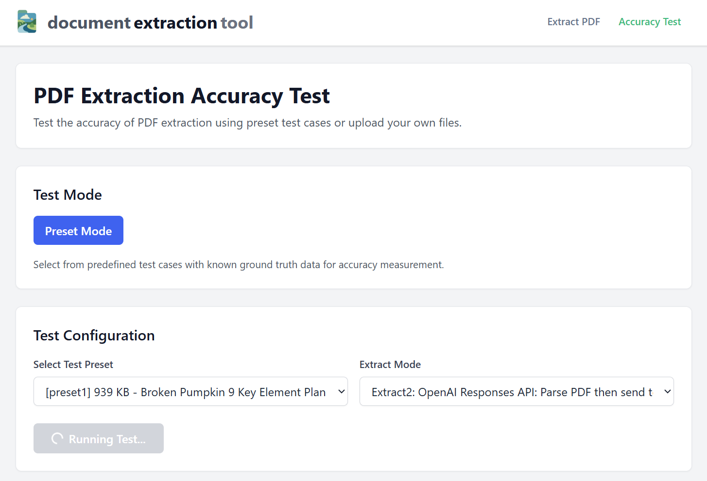

# Testing & Accuracy

This document describes how to test extraction accuracy and run validation on sample data.

## Accuracy Testing

### Endpoint

`POST /api/accuracy/test`

Tests the accuracy of extraction using sample data presets.

**Parameters:**

- `pdf`: The PDF file (form-data)
- `mode`: `'preset'`
- `preset`: `'preset1'` (options: preset1, preset2, preset3, preset4)
- `compare_mode`: `'ai'`
- `compare_mode_model`: `'gpt-4.1'`
- `extract_mode`: `'extract2'` (options: extract1, extract2, extract3)

### Example Request

```bash
curl -X POST http://localhost:5000/api/accuracy/test \
  -H "Content-Type: application/json" \
  -d '{"preset": "preset1", "extractMode": "extract2"}'
```

### Available Presets

- `preset1`
- `preset2`
- `preset3`
- `preset4`

### Available Extract Modes

- `extract` or `extract1`: Chat Completions API
- `extract2`: Responses API with text input
- `extract3`: Responses API with direct file upload

## Manual Testing

1. Start the server: `npm run dev`
2. Use Postman or curl to test endpoints
3. Upload a PDF file to any extract endpoint

## Frontend Integration

The [frontend application](https://github.com/aimoradajr/doc-extractor-tool-frontend) provides a user-friendly interface for running accuracy tests and viewing results.


